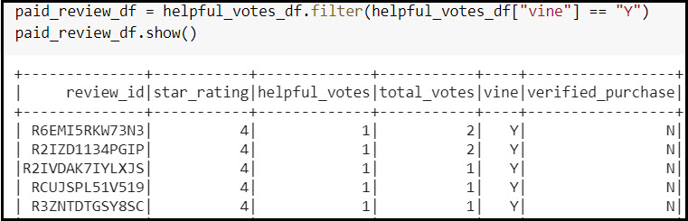
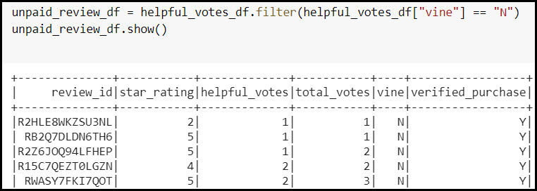
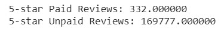
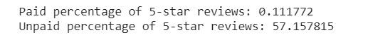

# Amazon_Vine_Analysis

# Overview
The ability to analyze “big data” is becoming an important aspect of the data analysis world. Within this project PySpark, Google Colab, pgAdmin, and Amazon Web Services (AWS) were utilized to analyze Amazon reviews written by members of the paid Amazon Vine program. We would like to determine if there is a bias towards favorable reviews from the members of the paid Vine program. 

The following dataset was used in the project. 
 
https://s3.amazonaws.com/amazon-reviews-pds/tsv/amazon_reviews_us_Watches_v1_00.tsv.gz

# Results
•	How many Vine reviews and non-Vine reviews were there?

Total number of Paid (Vine) Reviews: **945.000000**

Total number of Unpaid Reviews: **296087.000000**

•	How many Vine reviews were 5 stars? How many non-Vine reviews were 5 stars?
There were 332 Vine reviews and 169777 unpaid reviews in the analyzed dataset.

•	What percentage of Vine reviews were 5 stars? What percentage of non-Vine reviews were 5 stars?

Vine reviews accounted for 11% of the reviews and unpaid reviews accounted for 57% of the reviews. 

 

# Summary

Looking at the results of the analysis, there does not appear to be a positivity bias from reviews of members in the Vine program. 5-star ratings from members of the Vine program only account for 11 percent of the ratings. An additional analysis that I would recommend would be on star rating for verified purchases vs unverified purchases.  There would help to determine credibility of the reviews. 
